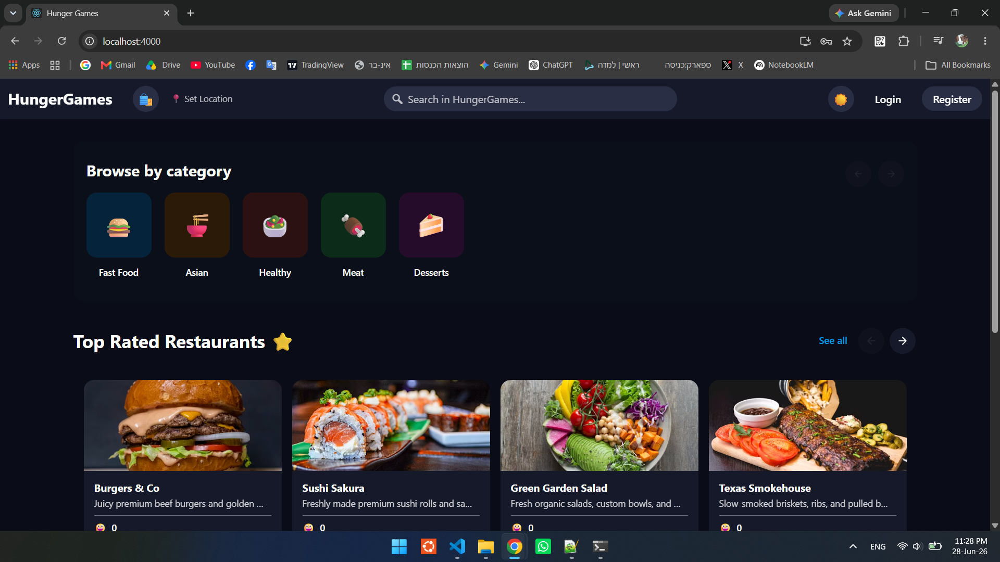
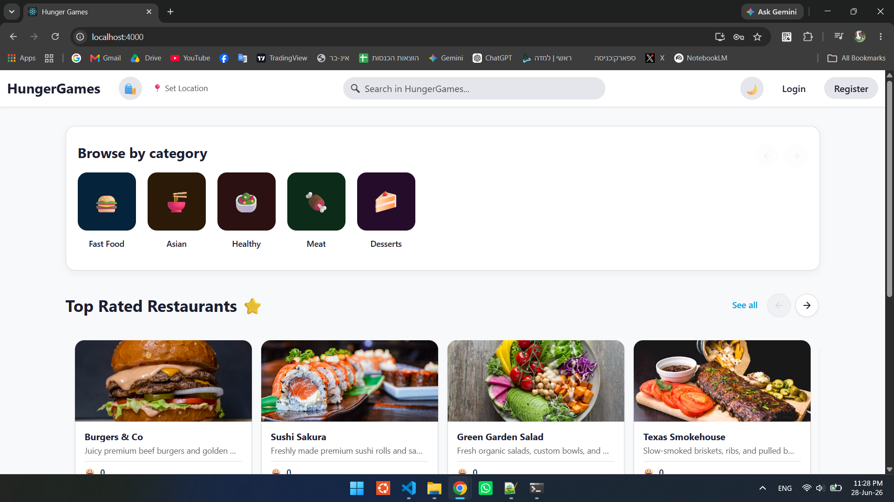
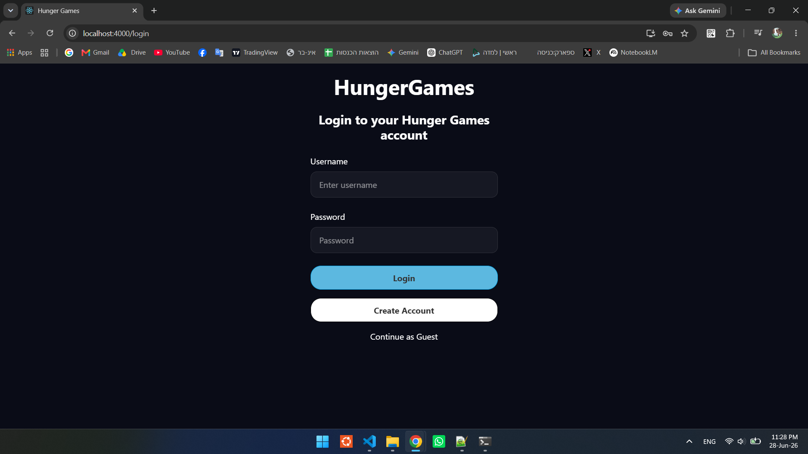
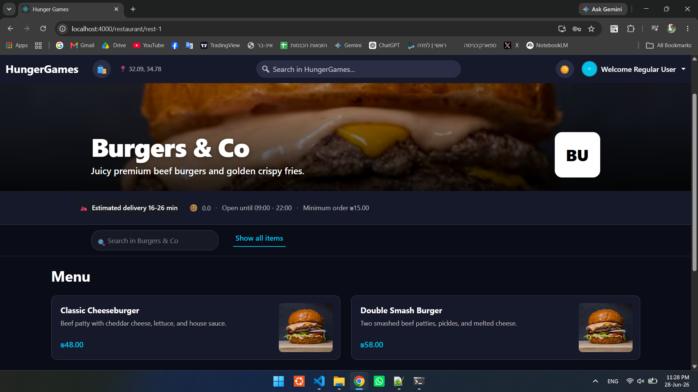
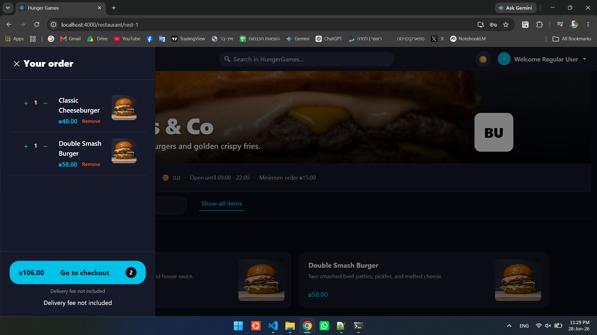
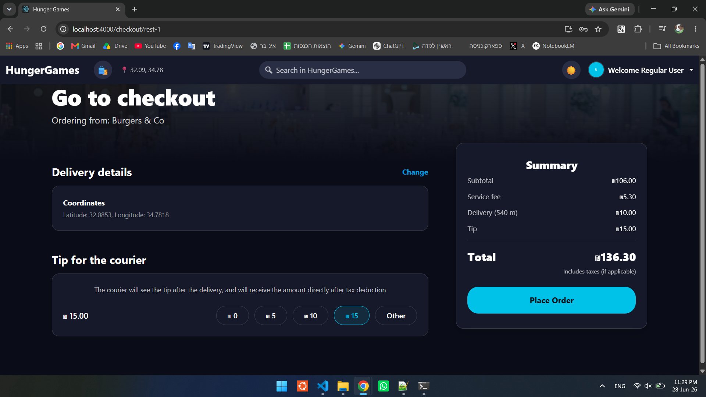
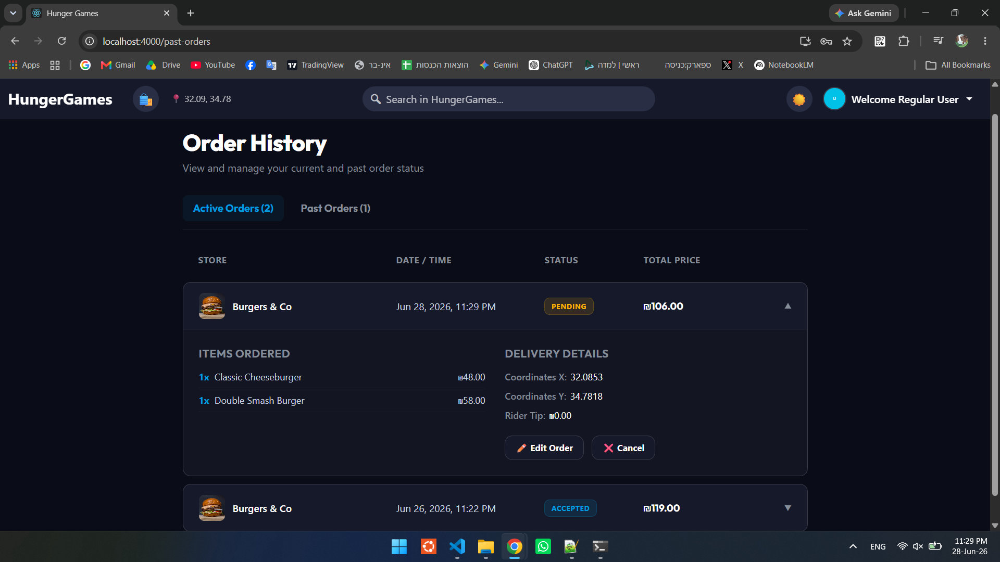
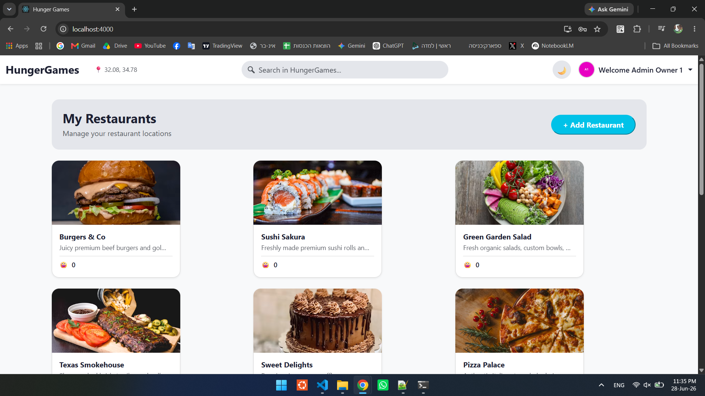
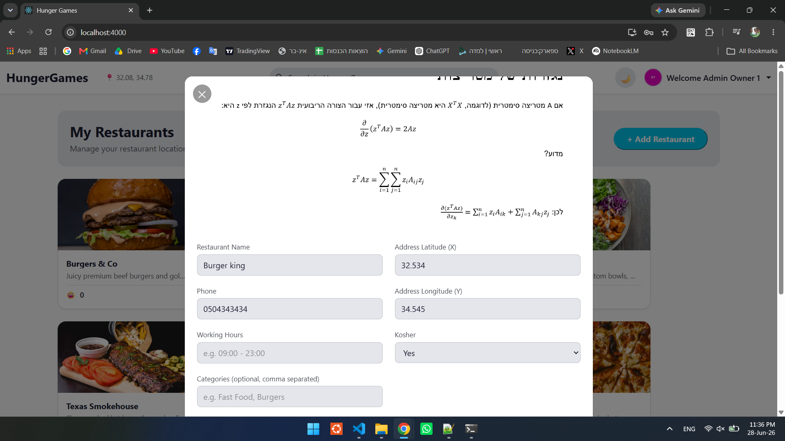
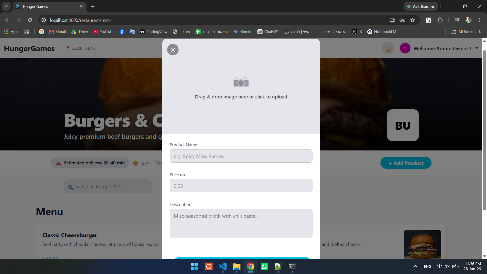

# Food Delivery Full-Stack Platform - Assignment 4 - HungerGames

## Project Description
This project was developed as part of the Advanced Programming course. In this stage (Assignment 4), we expanded our backend architecture into a complete, full-stack web application inspired by real-world delivery platforms (like Wolt). 

The system now features a dynamic React frontend that communicates seamlessly with our previously built backend, presenting real, database-driven data to the users.

The system is composed of three main components:
1. **The Frontend Application (React):** A dynamic Single Page Application (SPA) providing a modern user interface, handling client-side routing, state management, and real-time validations.
2. **The Main Web API (Node.js):** A RESTful web server built on the MVC pattern. It handles business logic, database management, strict server-side validation, and JWT-based authentication.
3. **The View History Engine (C++):** A background server communicating via TCP, dedicated exclusively to tracking and managing the product viewing history of authenticated users.

## Frontend Architecture & Features
The client-side application is built using **React** (HTML, CSS, JS) and utilizes modern hooks (`useState`, `useRef`, `useEffect`) and `react-router-dom` for seamless navigation without page reloads.

Key features include:
* **Authentication & Security (JWT):** A complete login and registration flow. Upon successful login, the server issues a JSON Web Token (JWT) which the React app securely stores and attaches to subsequent authorized requests.
* **Strict Validations:** Both the registration and login forms feature strict client-side validations (e.g., passwords must be at least 8 characters long, containing both letters and numbers). These validations are strictly mirrored on the Node.js backend.
* **Dynamic Content Display:** All entities (Restaurants, Products, Menus) are fetched dynamically from the Node.js API. No hard-coded mock data is used.
* **Global Search:** Users can search for specific items or restaurants directly from the top navigation bar.
* **Interactive UI & Dark Mode:** The application features a toggleable Light/Dark theme that globally updates the UI styling, mimicking a modern app experience.
* **Profile & Image Selection:** Users can select profile pictures during registration, which are then integrated into the UI (e.g., the top navigation bar).

## How the System Works

Our platform is designed to provide a complete, end-to-end food delivery experience, catering to both customers and business owners with distinct features and workflows:

* **Guest Browsing:** Unauthenticated users (guests) can freely browse the platform, discover restaurants, view menus, and even add products to their shopping cart. However, an account is required to proceed to checkout and finalize an order.
* **Role-Based Registration:** During the sign-up process, individuals can choose their account type. They can register either as a standard **Customer** or as a **Restaurant Owner**, with each role unlocking different capabilities.
* **Customer Experience & Recommendations:** Regular users can place orders and enjoy a highly personalized experience. The system's recommendation engine highlights nearby restaurants and highly-rated options to help users discover the best food around them.
* **Restaurant Management:** Users registered as Restaurant Owners have access to dedicated management capabilities. They can seamlessly create new restaurant profiles, manage operational details, and build their menus by adding products with custom names, descriptions, and prices.
* **Order Lifecycle & Editing:** When placing an order, users have the option to include a tip. Once submitted, the order enters a `PENDING` state. **A key feature is that users can actively edit their order as long as it remains `PENDING`.** The order transitions to `ACCEPTED` once the restaurant acknowledges and approves it (for demonstration purposes in this project, this transition is methodologically simulated to occur automatically after 30 seconds).
* **Global Search:** A powerful, persistent search functionality allows users to quickly find exactly what they are craving, whether they are searching for a specific restaurant name or a particular menu item across the entire platform.

## CRITICAL: Environment Configuration

**Before running the application, a `.env` file MUST exist inside the `config` directory with the following exact environment variables:**

```env
CPP_SERVER_PORT=8080
CPP_SERVER_HOST=cpp-server
NODE_PORT=3000
JWT_SECRET=Blahhh
```

Note: The JWT_SECRET is used for token signing and validation. You may change Blahhh to any custom secret string of your choice.

Failure to include these variables will result in authentication failures and broken server connections.

---
## Build Instructions 
All components of the application (React, Node.js, and C++) are containerized.

### 1. Build the Project
First, open your terminal in the main project directory (where the docker-compose.yml is located) and build the Docker images:
```bash
docker compose build --no-cache
```
    

### 2. Run the Servers
To start the servers in the background, type the following command (ports and IPs are automatically loaded from the `.env` file under the `config` directory):
```bash
docker compose up -d
```
**Once running, the React application will be accessible via http://localhost:4000**
> **Note:** It may take approximately 15-30 seconds for the application to become fully accessible in your browser after running the command. This is a normal delay while the Docker containers initialize, establish their internal network, and start the React development server.


#### 3. View Node.js Live Logs (Optional)
If you want to see the live logs of the Node.js server streaming in your terminal, run the following command. 
(Notice: This keeps the terminal attached to the logs. You will need to open another terminal window to run new commands):
```bash
docker compose logs -f web-js-server
```
      

#### 4. Run the Unit Tests (optional)
If you want to run the GoogleTest suite instead of the main interactive program, use this command:
```bash
docker compose run --rm tests
```


### 5. Stop the Server
The server runs continuously in the background. When you are done checking the project, use this command to safely stop and remove the containers:
```bash       
docker compose down
```


# Pictures For Example

## Example 1: Dark Mode & Main Page



## Run Example As A User:
**Login Screen**


**Resteurant Page**


**Plan An Order**


**Place An Order**


**Edit An Order At Pending**


## Run Example As A Resteurant Manager:

**HomePage - Owner's Restaurants**


**Adding/Editing A Restaurant**


**Adding/Editing A Product**


