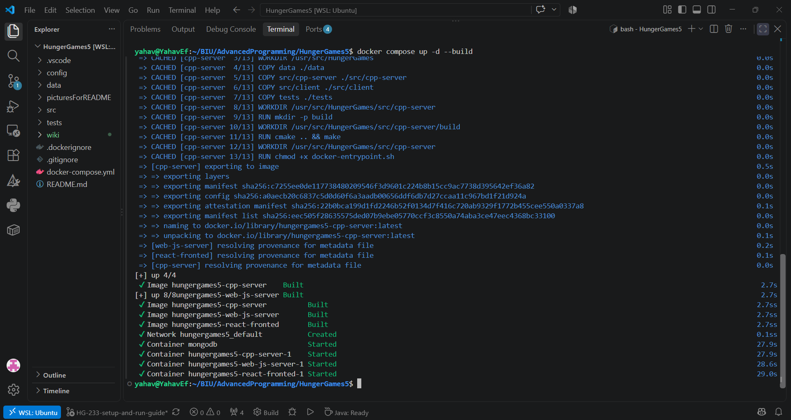
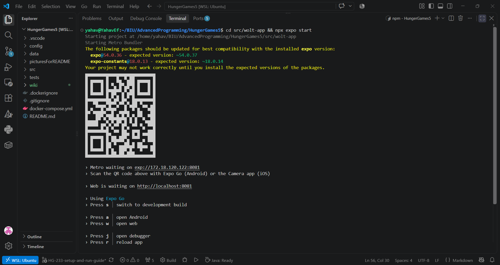
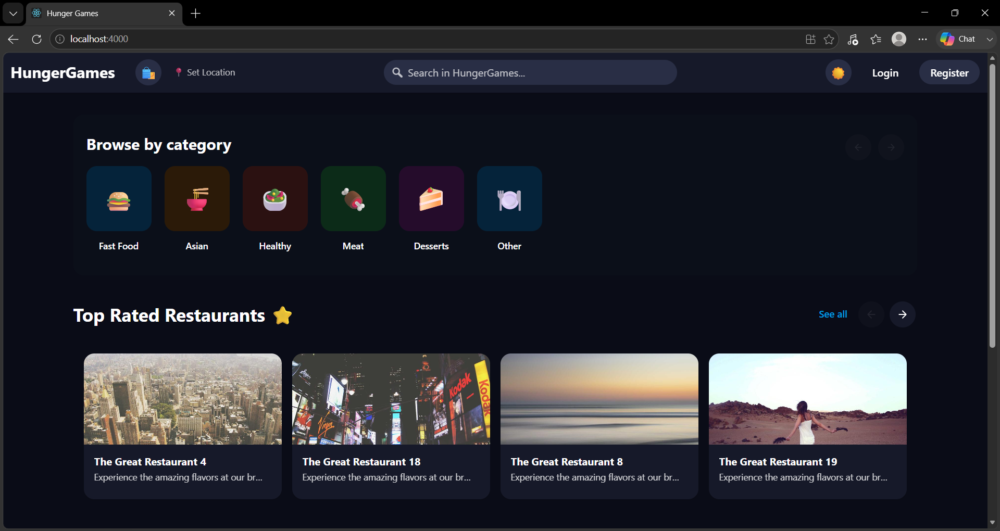
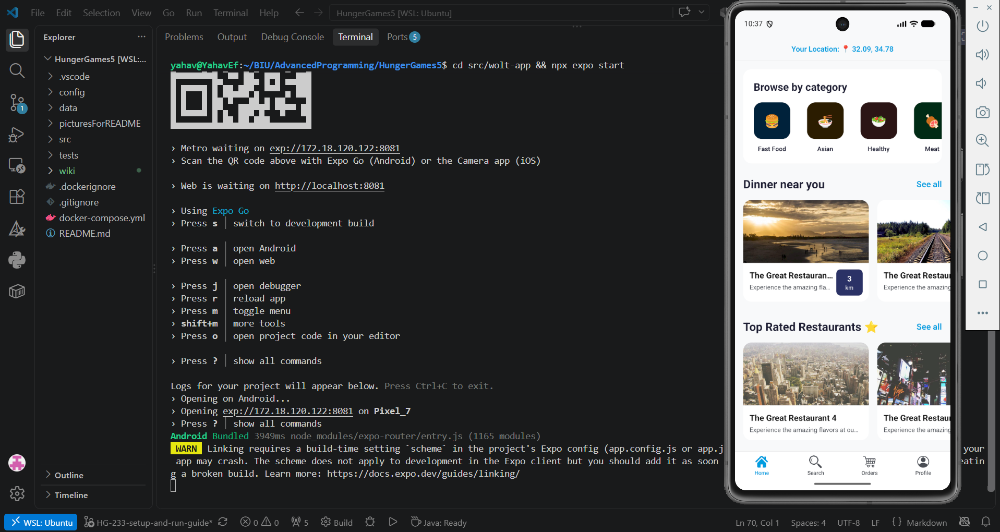
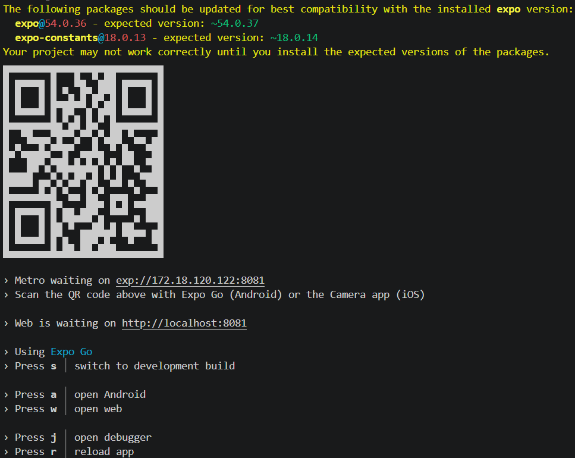

# Setup and Run Guide: HungerGames Platform

## 1. System Infrastructure & Architecture

The HungerGames platform utilizes a distributed, multi-service architecture designed to handle heavy loads and provide dedicated microservices for specific business domains. The system operates through the following interconnected services:

*   **MongoDB (Port `27017`)**: The primary NoSQL database storing users, orders, restaurants, and menu items.
*   **C++ Recommendation Server (Port `8080`)**: A high-performance backend microservice responsible for complex, CPU-intensive algorithms and recommendation generation.
*   **Node.js Backend API (Port `3000`)**: The primary REST API (`web-js-server`) that interfaces with the database, handles business logic, and acts as a gateway between the frontend clients and the C++ server.
*   **React Web Application (Port `4000`)**: The browser-based frontend for desktop/web users. Note that it maps port 4000 on the host to port 3000 inside its Docker container to avoid clashing with the Node.js backend.
*   **React Native Expo Mobile App (Port `8081`)**: The mobile application frontend built with Expo and React Native, running the Metro Bundler natively on the host machine.

All backend services communicate securely through the isolated Docker internal network, exposing only the necessary ports to the host machine (localhost) for frontend client consumption.

### CRITICAL: Environment Configuration

**Before running the application, a `.env` file MUST exist inside the `config` directory with the following exact environment variables:**

```env
CPP_SERVER_PORT=8080
CPP_SERVER_HOST=cpp-server
NODE_PORT=3000
JWT_SECRET=Blahhh
```

Note: The JWT_SECRET is used for token signing and validation. You may change Blahhh to any custom secret string of your choice.

Failure to include these variables will result in authentication failures and broken server connections.
## 2. Docker & Docker Compose

To ensure environments are completely isolated, highly consistent, and platform-agnostic, the entire backend ecosystem and web application are containerized using **Docker**. 

By defining the services in `docker-compose.yml`, we can orchestrate the simultaneous launch of the Database, C++ Server, Node.js Backend, and React Web App. Docker manages the internal networking and environment variables automatically, ensuring that regardless of what OS the checker is using, the core system spins up with identical dependencies in a single command.

## 3. Execution Commands

We utilize a **hybrid execution model**. The backend and web app run inside isolated Docker containers, while the Expo mobile application runs locally on the host machine to easily bridge the Android Debug Bridge (ADB) connection to local emulators.

### Step 3.1: Start the Backend Ecosystem
Open a terminal in the root directory of the project and execute:

```bash
docker compose up -d --build
```
*(This command builds the images if necessary and starts all containers in detached mode).*



### Step 3.2: Start the Mobile Application
Once the backend is fully running, open a **separate terminal**, navigate into the mobile app directory, and start the Expo server:

```bash
cd src/wolt-app && npm install && npx expo start
```



## 4. Running the Web Application

The React Web Application is fully containerized and starts automatically when you execute the `docker compose up` command. 

To access the web application:
1. Open any modern web browser (Chrome, Firefox, Edge, etc.).
2. Navigate to **[http://localhost:4000](http://localhost:4000)**.
3. You should see the HungerGames web interface successfully communicating with the backend.



## 5. Running the Mobile App

Once you execute `npx expo start`, the Metro Bundler CLI will launch in your terminal. You can run the application on either a virtual emulator or a physical device.

### Using an Android Emulator
1. Ensure your Android Emulator (via Android Studio) is running on your computer.
2. In the terminal where Expo is running, simply press the **`a`** key on your keyboard.
3. Expo will automatically connect to the emulator, install the Expo Go client if necessary, and launch the HungerGames app.



### Using a Physical Device
1. Download the **Expo Go** app on your personal iOS or Android smartphone.
2. Ensure your phone is connected to the same Wi-Fi network as your computer.
3. Open the Expo Go app and use the **"Scan QR Code"** feature to scan the large QR code displayed in your terminal.
4. The application will bundle and launch directly on your device.


