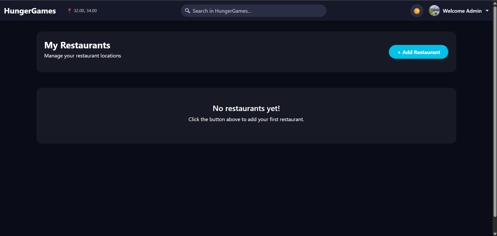
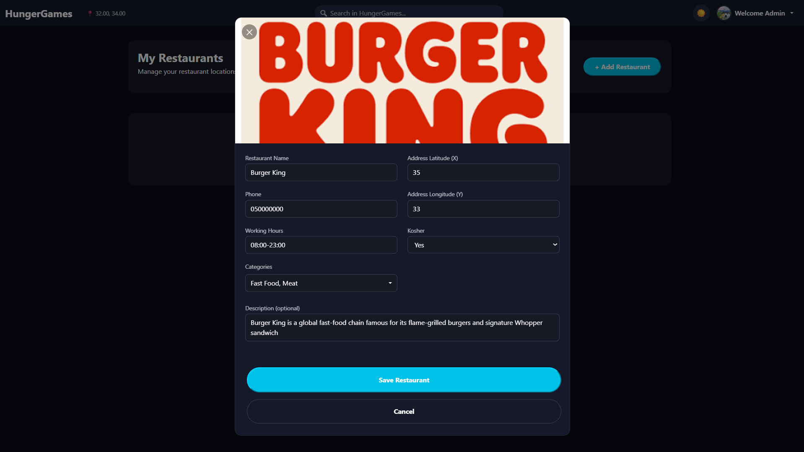
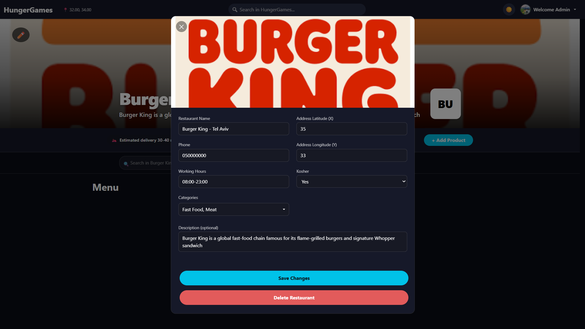
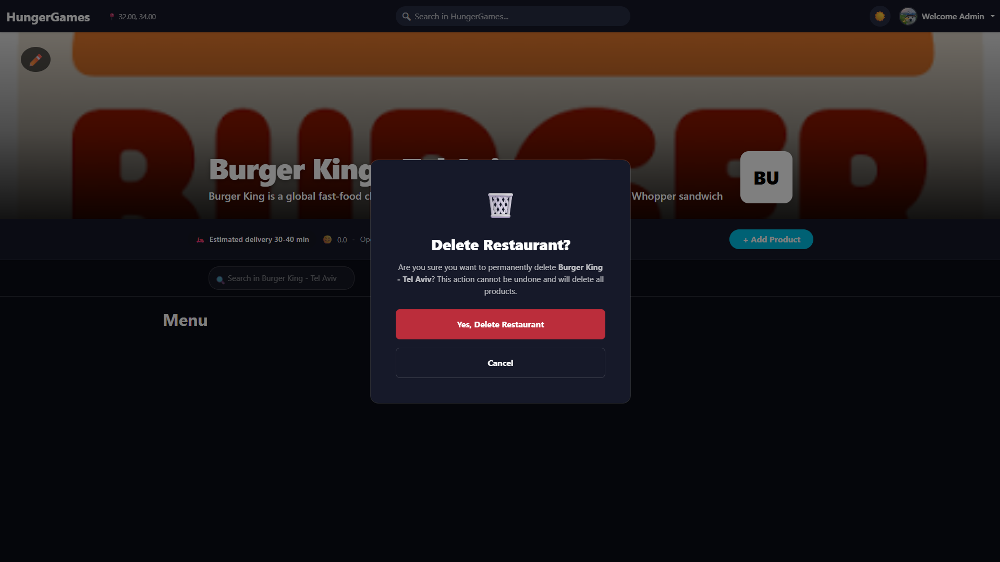
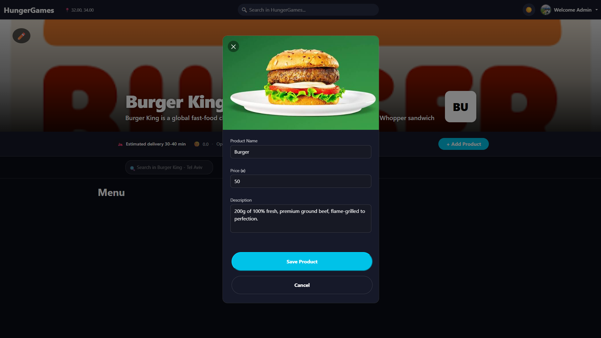
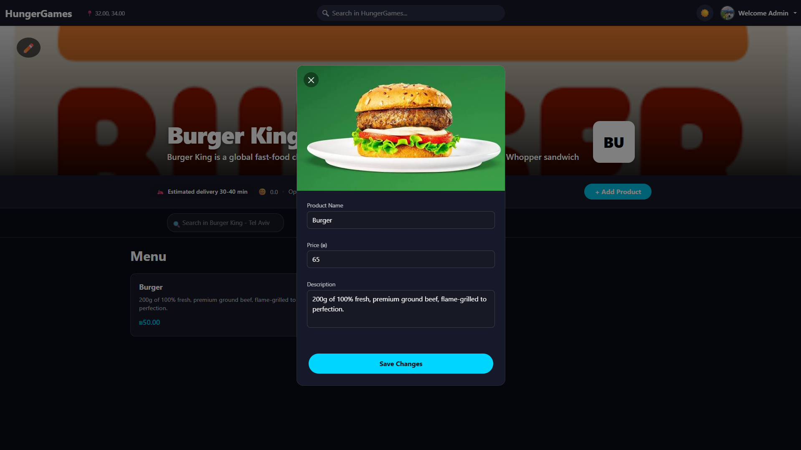
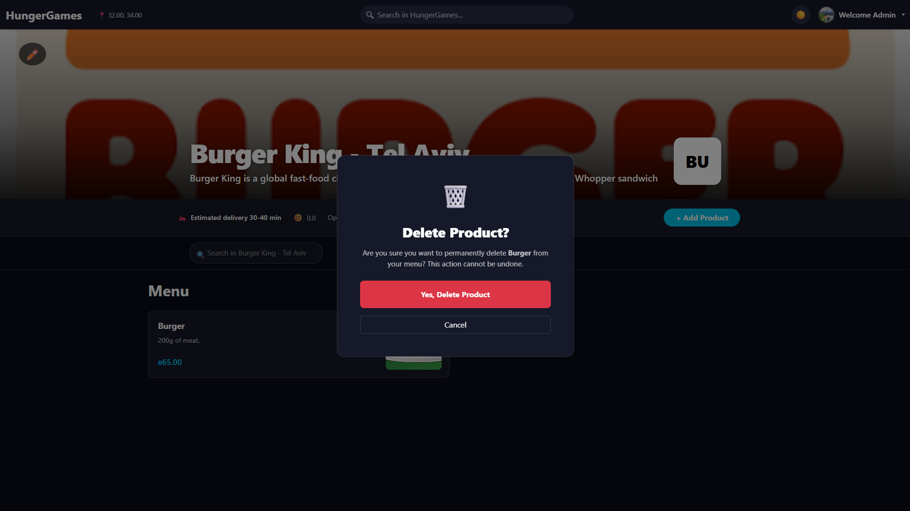

# Restaurant & Catalog Management Guide

The HungerGames platform provides dedicated administrative capabilities for Restaurant Owners and store managers. This document outlines the end-to-end workflows for managing restaurant profiles, configuring store operational details, and managing menu item catalogs across both Web and Mobile interfaces.

---

## 1. Overview

Restaurant Owners on HungerGames are equipped with full operational control over their online store presence. Through an intuitive administrative interface, store owners can establish brand visibility, maintain real-time store details, and dynamically tailor their product offerings.

Key administrative capabilities include:

*   **Restaurant Profile Provisioning & Editing**: Create new restaurant profiles, update contact details, set geographical location coordinates, configure operating schedules, assign cuisine categories, set kosher certification status, and upload high-resolution cover photos.
*   **Menu Catalog Control**: Add new dishes, edit item pricing, update descriptions, replace dish imagery, and permanently remove retired menu items.
*   **Role-Based Security**: Administrative controls are scoped exclusively to users holding the **Restaurant Owner** role. Unauthenticated users and regular customers cannot access management tools.
*   **Cross-Platform Synchronization**: Profile and catalog updates executed on web or mobile instantly reflect across the entire platform ecosystem.

---

## 2. Step-by-Step User Flow & Visuals

### Step 1: Accessing Management Dashboard

Authorized Restaurant Owners access store management tools directly from the primary navigation interface.

1.  **Log In as Restaurant Owner**: Sign into an account registered with **Restaurant Owner** permissions.
2.  **Navigation Controls**: Upon successful authentication, administrative controls become visible:
    *   **Main Header**: An **"+ Add Restaurant"** button appears in the main top navigation header.
    *   **Store Page Controls**: Navigating to an owned restaurant's page unlocks an **Edit Restaurant (✏️ pencil overlay icon)** button on the top banner and an **"+ Add Product"** button in the store information bar.

> 

---

### Step 2: Restaurant Profile Management (Create, Edit, Delete)

Restaurant Owners can register new restaurant locations, modify existing operational parameters, or decommission store profiles.

#### A. Creating a New Restaurant Profile

To establish a new restaurant on the platform:

1. Click the **"+ Add Restaurant"** button located in the top navigation bar.
2. Complete the required inputs in the **Add New Restaurant** form modal:
   * **Cover Image**: Upload a high-resolution hero photo by dragging and dropping an image file onto the header upload zone or by clicking to open the local file selector.
   * **Restaurant Name** *(Mandatory)*: Enter the public store display title (e.g., *Burger King*).
   * **Phone** *(Mandatory)*: Enter the official contact phone number (e.g., *050-1234567*).
   * **Working Hours** *(Mandatory)*: Specify operational hours (e.g., *09:00 - 23:00*).
   * **Categories** *(Optional / Multi-select)*: Open the dropdown menu and select all matching cuisine types (e.g., *Fast Food*, *Burgers*, *Asian*, *Pizza*, *Sushi*, *Desserts*).
   * **Address Latitude (X)** *(Mandatory)*: Enter the geographic latitude coordinate (e.g., *32.0853*).
   * **Address Longitude (Y)** *(Mandatory)*: Enter the geographic longitude coordinate (e.g., *34.7818*).
   * **Kosher Status**: Select **Yes** or **No** from the option dropdown.
   * **Description** *(Optional)*: Enter a short promotional description text for customers.
3. Click the **"Save Restaurant"** (or **"Create Restaurant"**) button to publish the profile.

> 

#### B. Editing an Existing Restaurant Profile

To modify existing store attributes:

1. Navigate to the targeted restaurant page.
2. Click the **Edit (✏️ pencil icon)** overlay button on the top-left of the hero banner image.
3. The **Edit Restaurant** modal opens pre-populated with current store details. Update any text fields, change options, or drop a replacement image into the banner upload dropzone.
4. Click **"Save Changes"** to apply updates (or **"Cancel"** if no modifications were made).

> 

#### C. Deleting a Restaurant Profile

To permanently remove a restaurant storefront:

1. Open the **Edit Restaurant** modal for the selected store.
2. Click the red **"Delete Restaurant"** action button.
3. A confirmation dialog titled **"Delete Restaurant?"** appears with a safety prompt: *"Are you sure you want to permanently delete [Restaurant Name]? This action cannot be undone and will delete all products."*
4. Click **"Yes, Delete Restaurant"** to confirm permanent deletion, or click **"Cancel"** to dismiss the dialog safely.

> 

---

### Step 3: Menu & Item Catalog Management (Add, Edit, Delete)

Store managers maintain real-time control over their menu catalog, including adding new offerings, adjusting item pricing, editing descriptions, and removing dishes.

#### A. Adding a New Menu Item

To add a dish to the restaurant catalog:

1. Open the restaurant page and click the **"+ Add Product"** button in the store information bar.
2. Fill out the **Add Product** modal fields:
   * **Product Image** *(Mandatory)*: Drag & drop an image file onto the upload zone or click to select a photo file.
   * **Product Name** *(Mandatory)*: Enter the title of the dish (e.g., *Spicy Miso Ramen*).
   * **Price (₪)** *(Mandatory)*: Enter a positive numeric value for the item price (e.g., *45.00*).
   * **Description** *(Mandatory)*: Provide dish details, ingredients, or flavor profile notes.
3. Click **"Save Product"** to publish the new item to the public menu catalog.

> 

#### B. Editing a Menu Item

To edit dish details or update prices:

1. Click on any dish card displayed within the restaurant menu grid.
2. In the product detail modal, click the **"Edit Product"** button.
3. Modify the item name, numerical price, description text, or upload a replacement photo.
4. Click **"Save Changes"** to save catalog updates.

> 

#### C. Deleting a Menu Item

To remove an item from the menu catalog:

1. Click on the target dish card in the menu view to open its detail modal.
2. Click the red **"Delete Product"** button.
3. Review the confirmation prompt titled **"Delete Product?"**: *"Are you sure you want to permanently delete [Product Name] from your menu? This action cannot be undone."*
4. Click **"Yes, Delete Product"** to remove the item from the database, or click **"Cancel"** to retain the item.

> 
