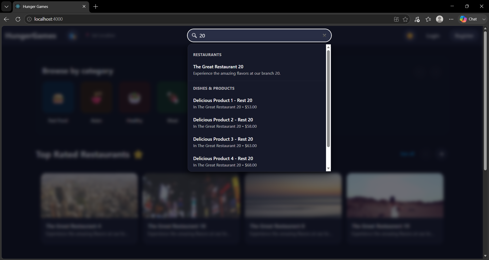
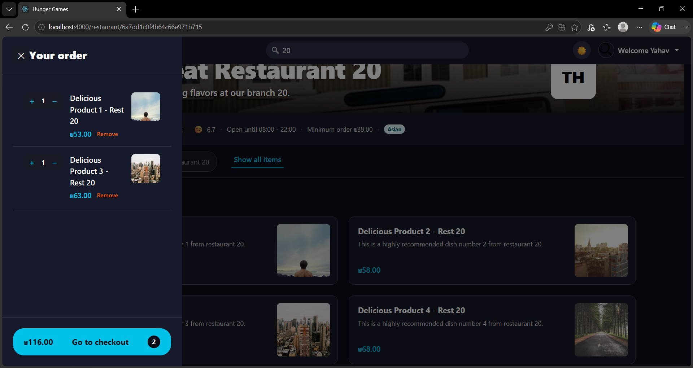
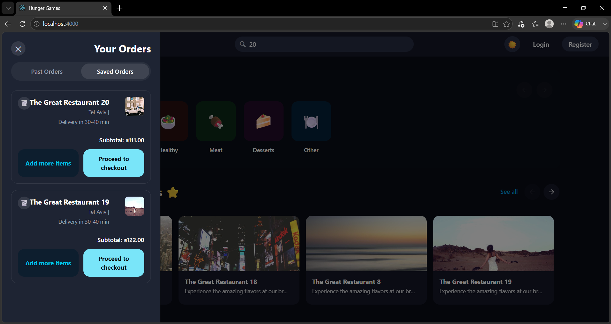
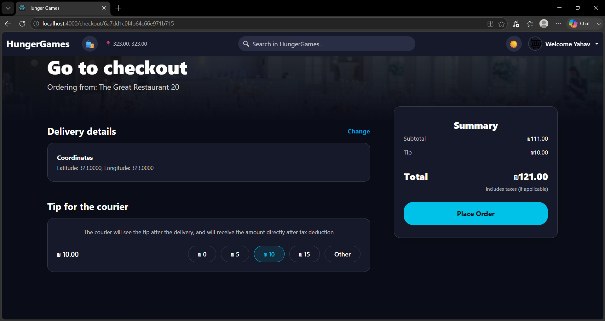
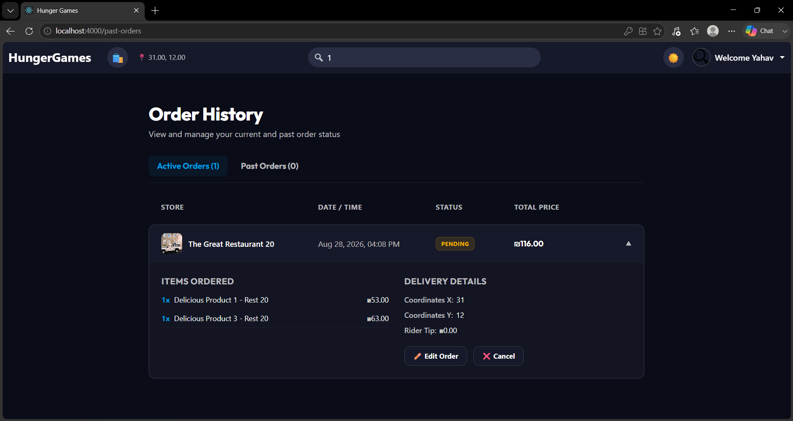
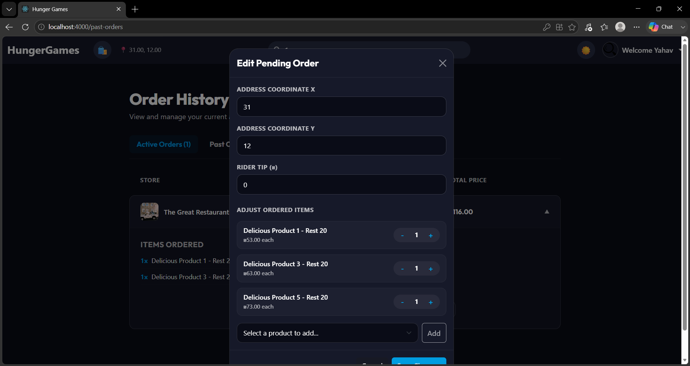
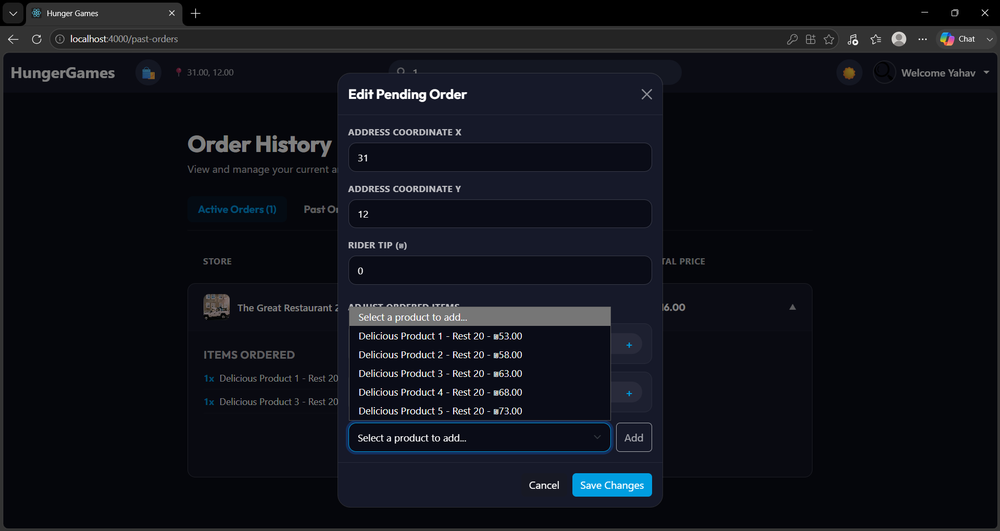
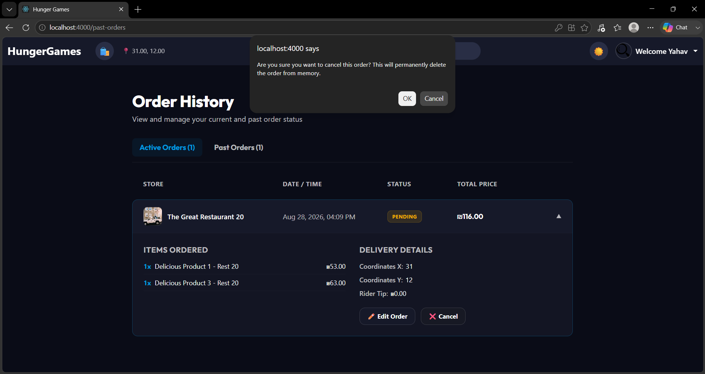
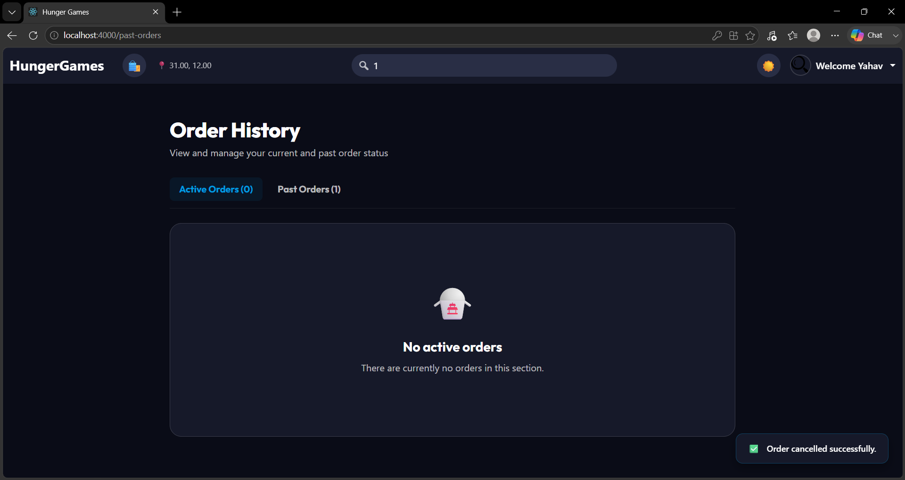

# Order Flows & Cross-Platform Synchronization

The HungerGames platform provides a highly synchronized, cross-platform order lifecycle. This document outlines the core business logic from discovery through cancellation, demonstrating how our unified backend state drives a seamless experience across all clients.

---

## 1. Discovery & Cart

The order lifecycle begins with our optimized discovery flow, allowing users to rapidly find exactly what they are craving.

*   **Live Search Functionality**: Our discovery interface features an instantaneous, live search engine. As users type, it immediately filters available restaurants and specific menu products, ensuring a frictionless browsing experience without unnecessary page reloads.

*   **Shopping Cart State**: As items are added, the global shopping cart state accurately calculates subtotals, manages item quantities, and handles restaurant isolation (preventing users from building carts across multiple restaurants simultaneously).

---

## 2. Order Creation & Navigation

Submitting an order transitions the cart state into our backend persistence layer.

*   **Submission & Confirmation**: Upon checking out, the payload—containing the requested items, calculated tip, and delivery coordinates—is dispatched to the backend API. The backend verifies the transaction and creates a new order in a `PENDING` state.

*   **Smart Tab Routing**: Upon successful submission, the client navigation architecture intelligently intercepts the flow. Instead of dropping the user onto a generic screen, it automatically routes them directly to the **"Active Orders"** view, isolating live orders from past history so they can immediately track their status.

---

## 3. Complex Operations - Edit Order

We implemented an advanced, highly flexible feature rarely seen in standard delivery apps: the ability to edit a `PENDING` order on the fly before it is accepted by the restaurant.

*   **Live Edit Capabilities**: Users can modify their delivery coordinates, adjust the courier tip, and completely overhaul their order items without needing to cancel and restart.

*   **Dynamic Edit Interface**: The edit interface provides an advanced view where users can manage their current selections. Crucially, it includes an integrated list that fetches and displays the entire restaurant menu, allowing users to seamlessly browse and dynamically inject entirely new products into their existing live order.

---

## 4. Cancellation & Cross-Platform Sync

A robust architecture requires perfect state synchronization across all connected clients.

*   **Cancellation Flow**: If a user decides to abort a pending order, they are met with a fail-safe warning prompt to prevent accidental deletions. Once confirmed, a `DELETE` request is sent to the backend, halting the order lifecycle.

*   **Instant Cross-Platform Synchronization**: The platform demonstrates true headless synchronization. Because both the Web and Mobile clients act as mirrored lenses into the unified backend database, an order canceled on one platform will instantly be removed from the active orders view on any other logged-in device.

