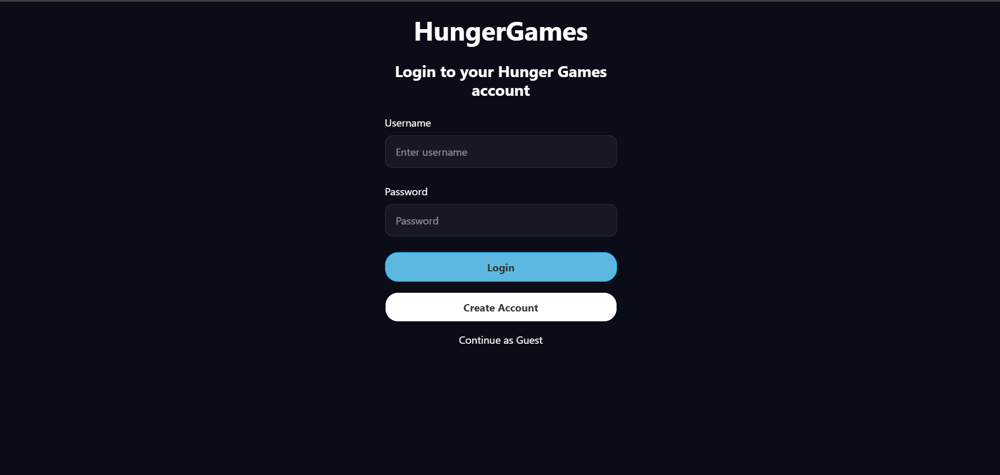
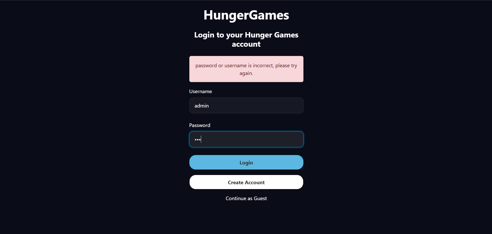
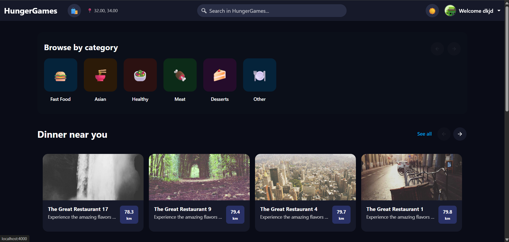

# User Login Guide

## 1. Overview

The **User Login** flow provides an authentication portal for registered users across Web and Mobile HungerGames applications. The process authenticates two primary user roles:

- **Customers**: Grants access to personalized venue listings, cuisine category carousels, active shopping cart drawer, and order placement.
- **Restaurant Owners**: Grants access to venue administration controls, product catalog editing, price updates, and menu item management.

---

## 2. Step-by-Step User Flow & Visuals

### Step 1: Accessing Screen
Launch the application or navigate to the sign-in URL. Unauthenticated users are presented with the main login card featuring the HungerGames branding, credential input fields, sign-in button, and registration navigation link.

> *Initial login screen layout on Web and Mobile showing empty fields, login button, and registration link.*
> 

---

### Step 2: Form Completion & Validation Check
Users submit their credentials to sign in:

- **Required Form Fields & Controls**:
  - **Username**: Registered account handle entered in the username text input box.
  - **Password**: Account security key entered in the secure password input box.
  - **Log In Button**: Action button to submit credentials for verification.
  - **Register Link**: Navigation link to switch to the account creation page for new users.

- **Validation Rules & Visual Alerts**:
  - **Empty Input Field Highlights**: Submitting the form with blank username or password fields highlights the inputs with red borders.
  - **Invalid Credentials Error Alert Banner**: Entering unverified credentials displays a top red alert banner (*"Invalid username or password"*).
  - **Active Session Auto-Redirect**: Signed-in users attempting to access the login page are automatically navigated to the home dashboard.

> *Login screen displaying visual error indicators, including red input borders and top red error alert banner for invalid credentials.*
> 

---

### Step 3: Successful Action & Redirection
Upon submitting valid credentials:

- The system authenticates the user and establishes an active session.
- Access tokens are stored securely to maintain the logged-in state.
- The user is automatically redirected to the main **Home Dashboard**, displaying personalized venue carousels, category filters, navigation controls, and profile avatar access.

> *Main Home Dashboard displayed immediately after successful user authentication, showing active session state and venue listings.*
> 
