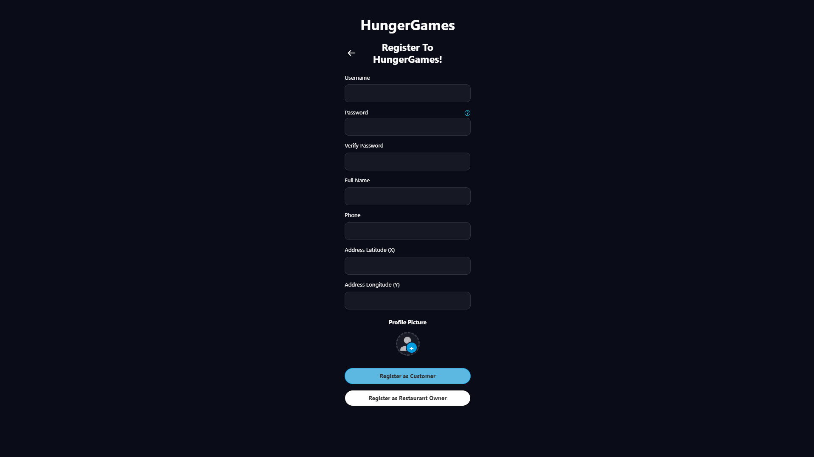
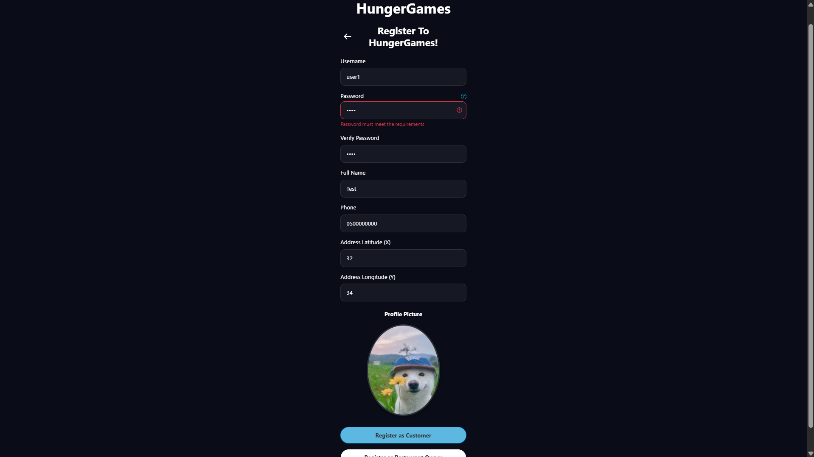
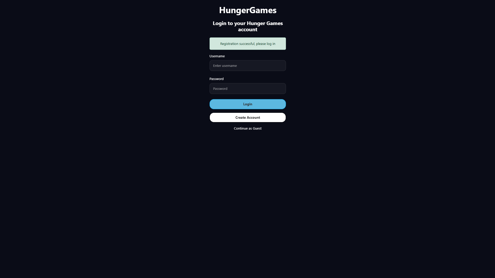

# User Registration Guide

## 1. Overview

The **User Registration** flow provides a structured onboarding experience for new users accessing the HungerGames platform across Web and Mobile applications. The system supports two primary user roles:

- **Customer (`user`)**: Grants access to venue browsing, menu item customization, shopping cart management, order placement, and live delivery tracking.
- **Restaurant Owner (`owner`)**: Grants access to restaurant administration, catalog management, product creation, pricing updates, and venue profile editing.

---

## 2. Step-by-Step User Flow & Visuals

### Step 1: Accessing Screen
To begin registration, open the application and click or tap the **Register** link located on the sign-in screen. This displays the main registration interface featuring the HungerGames logo header, a back navigation button, and empty input fields.

> *Initial registration screen layout displaying input fields, photo selector, and dual role submission buttons.*
> 

---

### Step 2: Form Completion & Validation Check
Users fill out all required profile details and select their account type:

- **Required Form Fields**:
  - **Username**: A unique account identifier.
  - **Password**: Account security key requiring at least 8 characters, containing uppercase letters, lowercase letters, and numeric digits.
  - **Confirm Password**: Confirmation field that must match the entered password.
  - **Full Name**: The user's full display name.
  - **Phone Number**: Primary contact phone number (numerical digits only).
  - **Address X (Longitude)**: Spatial coordinate for map positioning and delivery radius.
  - **Address Y (Latitude)**: Spatial coordinate for map positioning and delivery radius.
  - **Profile Picture Avatar**: Avatar photo uploaded via file selector or drag-and-drop on Web, or captured using the device camera / gallery picker on Mobile.
  - **Role Selection Buttons**: Action buttons allowing the user to select their role (**Register as Customer** or **Register as Restaurant Owner**).

- **Validation Rules & Visual Error Indicators**:
  - **Empty Input Highlights**: Blank required fields are highlighted with red input borders upon submission.
  - **Password Complexity Tooltip**: An interactive popover displays rules (minimum 8 characters, uppercase, lowercase, number).
  - **Password Mismatch Warning**: Displays a red warning notice when passwords do not match (*"Passwords do not match."*).
  - **Phone Format Alert**: Displays a red warning notice when non-digit characters are entered (*"Phone number must contain only digits."*).
  - **Profile Photo Alert**: Displays a warning notice when no photo has been selected (*"Please select a profile picture."*).
  - **Duplicate Username Alert Banner**: Displays a top red alert banner if the username is already registered (*"Username already exists"*).
  - **Device Camera/Gallery Permissions**: Prompts for native device access permissions when uploading an avatar on Mobile.

> *Registration form showing visual error highlights on invalid inputs and top error alert banners.*
> 

---

### Step 3: Successful Action & Redirection
When all inputs are valid and the user submits the form:

- Account creation is processed and form fields are cleared.
- The user is automatically redirected to the **Login** screen.
- A prominent green success banner appears at the top of the Login card displaying: *"Registration successful, please log in"*.

> *Login screen displayed immediately after successful account creation showing the green success confirmation banner.*
> 
